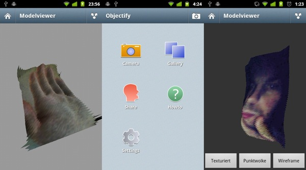
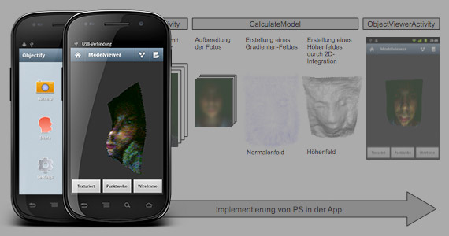

# Objectify
The first mobile 3D scanner for Android.

With this app you can capture 3D models of yourself, friends or family members
and share the results afterwards. Objectify uses the front-facing camera and
the smartphone display to create light reflections to calculate a 3D model
from the picture. You can achieve best results in a very dark environment.

This app was initially developed as part of my bachelor thesis at the RheinMain
University of Applied Sciences in Wiesbaden and later released at the Google 
Play Store. Since I don't have time anymore to actively support or develop this
app, I've decided to open source it.

## Media attention

* [http://www.aptgetupdate.de/2011/08/19/objectify-mobiler-3d-scanner-fur-android/](http://www.aptgetupdate.de/2011/08/19/objectify-mobiler-3d-scanner-fur-android/)
* [http://www.netzwelt.de/download/foto-grafik/3d-software-rendering/index.html](http://www.netzwelt.de/download/foto-grafik/3d-software-rendering/index.html)
* [https://www.mendeley.com/research/3drekonstruktion-auf-einem-smartphone-mittels-photometric-stereo/](https://www.mendeley.com/research/3drekonstruktion-auf-einem-smartphone-mittels-photometric-stereo/)
